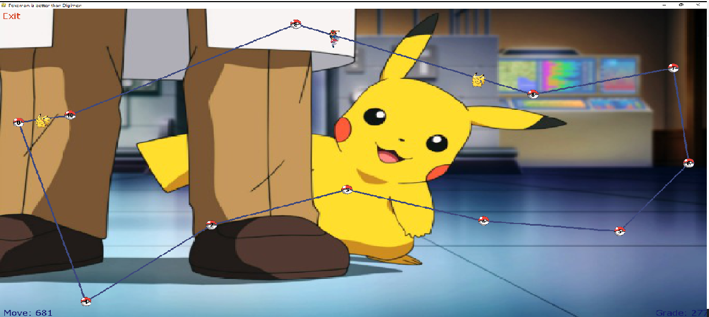

-- Ex4 --
@authers Elhai Agassi & Ofek Avi Saadon & Barak
    

*introduction*

In this assignment we were asked to create a Pokémon Game in which given a weighted graph
,a set of “Agents” that located on it, so they could “catch” as many “Pokémon” as possible.
An important detail is that every pokemon has a different value of points and we need to collect as many points as possible.
The Pokémon are located on the graph’s edges, therefore, the agent needs to take the proper edge to “grab” the pokemon.
As we can see we are given a specific and limited time and moves ,clearly the moves are dependents on the distance of the pokemons from the agents. 
The mission is to maximize the overall sum of weights of the “grabbed” pokemons.
*Project Materials*

For understanding all the problem space we assisted the videos of William Fiset and wikipedia:

[//]: # (https://www.youtube.com/channel/UCD8yeTczadqdARzQUp29PJw)

[//]: # (https://en.wikipedia.org/wiki/Directed_graph)

[//]: # (https://en.wikipedia.org/wiki/Graph_center)
https://en.wikipedia.org/wiki/Dijkstra%27s_algorithm

Also, for few of the algorithms implementations we assisted GeeksForGeeks and StackOverFlow forums.
https://www.geeksforgeeks.org/
https://stackoverflow.com/

*UML of the project*

*Explanation on the classes*

-main-

-DiGraph-
Implement of the representing a graph with the follows methods:
    v_size -> return int: number of nodes in the graph
    e_size -> return int: number of edges in the graph
    get_all_v -> return dict: dictionary of all the nodes in the graph
    all_in_edges_of_node -> return dict: dictionary of all the edges whom go into specific node
    all_out_edges_of_node -> return dict: dictionary of all the edges whom go out of specific node
    get_mc -> return int: represent the number of changes the graph had
    added_edge -> return bool: add edge to the graph
    add_node -> return bool: add node to the graph
    remove_node -> return bool: remove node from the graph
    remove_edge -> return bool: remove edge from the graph

More functions in Digraph that are not implement of GraphInterface:
    getEdgeBySrc -> return list: Listing all the neighbors of specific node
    getWeightOfEdge -> return float: return the weight of an edge

-GraphAlgo-
Implement of Class DiGraph:
    get_graph -> DiGraph: Return the current graph
    load_from_json -> bool: Load graph from json file
    save_to_json -> bool: Save graph to json file
    shortest_path -> (float, list): Return the shortest path from one node to another
    TSP -> (List[int], float): Finds the shortest path that visit all the nodes in the list.
    centerPoint -> (int, float): Finds the node that has the shortest distance to it's farthest node.
    plot_graph -> None: Plot the graph

More functions in GraphAlgo that are not implement of GraphInterface:
    Dijkstra -> 
    find_way -> list: Find the best circle permute for node. (helper functions for TSP)
    relax ->

-Node-
    getkey -> : Return the id associated with the node
    getpos -> : Returns the pos associated with this node

    getinfo -> : Returns the data within this node
*GUI*

*Running Time*

*How to run the program*
   
    java -jar Ex4_Server_v0.0.jar 1

